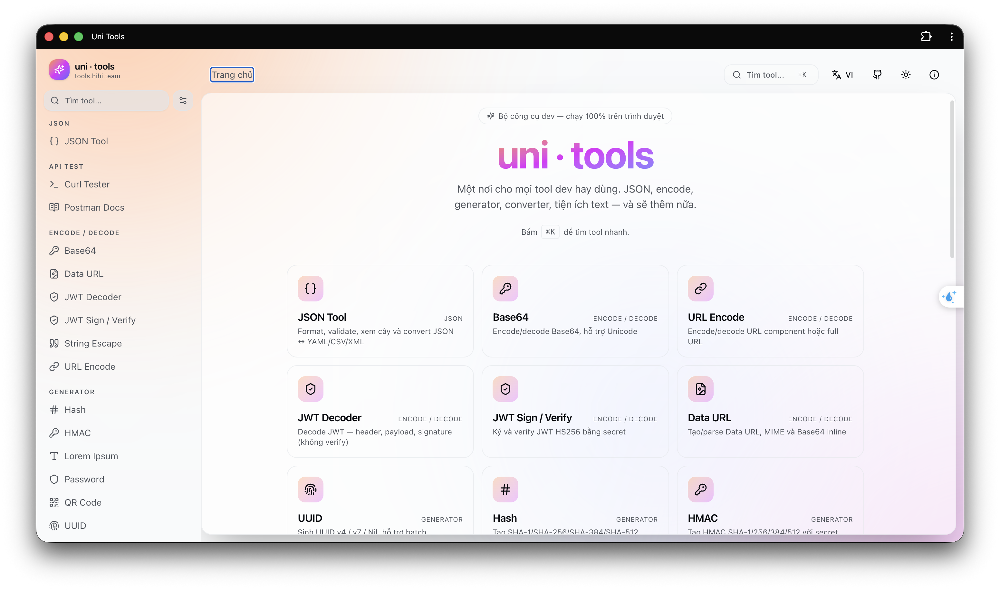
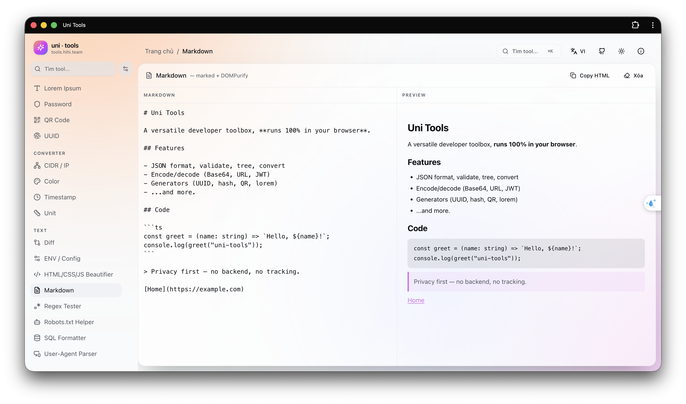

<div align="center">
  <h1>uni tools</h1>
  <p><strong>Open-source developer toolbox that runs in your browser.</strong></p>
  <p>
    Local-first utilities for JSON, JWT, Base64, Hash, HMAC, QR, Regex, Markdown, Curl, Postman docs and more.
  </p>

  <p>
    <a href="https://tools.hihi.team"><strong>Live Demo</strong></a>
    ·
    <a href="https://github.com/padit69/uni-tools/issues">Report Bug</a>
    ·
    <a href="https://github.com/padit69/uni-tools/issues">Request Feature</a>
  </p>

  <p>
    <a href="https://tools.hihi.team">
      
    </a>
    <a href="https://hits.sh/github.com/padit69/uni-tools/">
      
    </a>
    <a href="LICENSE">
      
    </a>
    
    
    
  </p>
</div>

## Preview

> Put your screenshots at these paths and GitHub will render them automatically.

<p align="center">
  
  
</p>

## Why

`uni tools` is a fast, privacy-friendly toolkit for common developer tasks. It is built as a static React app, so it can run on Vercel, Netlify, Cloudflare Pages, GitHub Pages or any static host.

- Browser-first: most tools process data locally without a backend.
- No tracking in the current source.
- Fast workflow with sidebar categories and command palette.
- PWA-ready with manifest and service worker.
- Easy to extend through a central tool registry.

> Note: Curl Tester can send HTTP requests to the URL you enter because that is the purpose of the tool.

## Tools

| Category | Tools |
| --- | --- |
| JSON | JSON format, minify, validate, tree view, JSON <-> YAML/CSV/XML |
| Encode / Decode | Base64, URL Encode, JWT Decoder, JWT Sign / Verify, Data URL, String Escape |
| Generators | UUID, Hash, HMAC, QR Code, Lorem Ipsum, Password |
| Converters | Timestamp, Color, Unit, CIDR / IP |
| Text | Diff, SQL Formatter, HTML/CSS/JS Beautifier, User-Agent Parser, Robots.txt Helper, ENV / Config, Regex Tester, Markdown |
| API | Curl Tester, Postman Docs |

## Stack

| Area | Tech |
| --- | --- |
| App | Vite, React 19, TypeScript |
| Styling | Tailwind CSS v4, Radix UI primitives, shadcn-style components |
| Routing | React Router 7 |
| Editor | CodeMirror 6 |
| Testing | Vitest |
| Utilities | `jsonc-parser`, `js-yaml`, `papaparse`, `fast-xml-parser`, `jose`, `qrcode`, `marked`, `dompurify`, `diff`, `colord` |

## Quick Start

### Requirements

- Node.js 22+
- pnpm

### Install and run

```bash
pnpm install
pnpm dev
```

Open:

```text
http://localhost:5173
```

### Useful scripts

```bash
pnpm build        # production build
pnpm preview      # preview dist locally
pnpm test         # run tests
pnpm test:watch   # watch tests
pnpm lint         # TypeScript check
```

## Project Structure

```text
src/
├─ components/
│  ├─ layout/             # AppShell, Sidebar, TopBar, ToolHost
│  ├─ command-palette/    # Command palette from registry
│  ├─ theme/              # Light/Dark/System
│  └─ ui/                 # UI primitives
├─ hooks/                 # Local storage, tool history
├─ lib/                   # Shared utilities
├─ pages/                 # Home, info, legal, not found
├─ tools/
│  ├─ registry.ts         # Central tool registry
│  ├─ types.ts
│  ├─ _template/          # New tool template
│  └─ */                  # Independent tool modules
├─ i18n.tsx
├─ routes.tsx
└─ main.tsx
```

## Add a Tool

Copy the template:

```bash
cp -r src/tools/_template src/tools/<your-tool>
```

Update `src/tools/<your-tool>/Tool.tsx`, then register the tool in `src/tools/registry.ts`:

```ts
{
  id: "base64",
  slug: "base64",
  name: "Base64",
  category: "encode",
  icon: KeyRound,
  description: "Encode / decode Base64 (UTF-8 safe)",
  keywords: ["base64", "encode", "decode"],
  Component: lazy(() => import("./base64/Tool")),
}
```

The sidebar, command palette and `/tools/<slug>` route will pick it up automatically.

## Deploy

Build static files:

```bash
pnpm build
```

Deploy the `dist/` directory to any static host. For SPA routing, rewrite every path to `/index.html`.

This repo includes `vercel.json`:

```json
{
  "rewrites": [
    {
      "source": "/(.*)",
      "destination": "/index.html"
    }
  ]
}
```

## Contributing

Contributions are welcome. Keep tool logic scoped inside `src/tools/<tool-name>/` and register public metadata through `src/tools/registry.ts`.

Before opening a pull request:

```bash
pnpm lint
pnpm test
```

## License

Released under the [MIT License](LICENSE).
